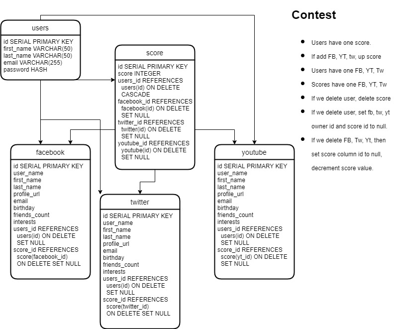

# Contest App

A simple form that allows someone to sign up with a username and password, to create a profile page.  On the profile page, they can do "tasks" that if they finish, add to a "total score".  

At a pre-determined date, a "drawing" will happen where someone (or more than one person) will be selected from a pool of entries.

The higher the score, the more "chances" someone has of winning. For example, a score of 10/10 points means that the person has a 100% chance of being in the final "pool" of entries.  A score of 9/10 would mean a 90% chance of being in the final pool, and so on — perhaps all the way to a minimum score of 5/10 (50% chance of being selected in final pool).   The computer will then pick a name from the final entry pool at random, and that person will be deemed a winner, and contacted.

## What's Needed

- Sign up Form
- Profile page w/login and logout
- Database

## Database Design

## Contest Selection

Data will look something like:

Name | Score
|:---:|:---:|
| Joey | 5 |
| David | 8 |
| Matt | 7 |

The algorithm selects 100% of the users with score 10, 90% of users with score 9 randomly, 80% of users with score of 8 randomly, and so on.

In above example, Dave has a score of 8, so we would pick a number at random (up to 10) and if it was higher than 2, Dave would get selected — he has an 8/10 chance of being selected.   For Matt, we'd pick a number again randomly, and if it was higher than 3, he'd get selected.  For Joey, we'd pick a number randomly and if it was higher than 5, he'd be added to the final pool.

Let's say Dave's random number is 7.  Since it's higher than 2, Dave gets added to final pool.  Matt gets a random number of 1, so he's out.  Joey gets a random number of 6, so he's in.

The final pool would be:

| Name | 
|:-----:|
| Joey | 
| David|

From, here we'd pick a random number up to the size of the final pool (so up to 2 here).  If the number is 1, Joey wins.  If the number is 2, David wins.

## Implementation

Can use any coding language desired, Python, JS, etc.